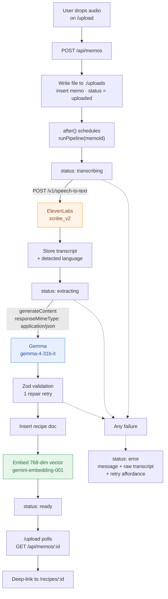
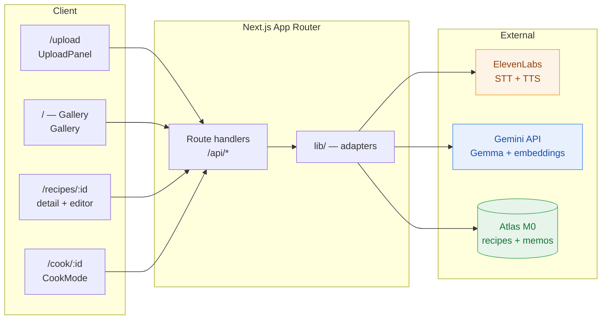
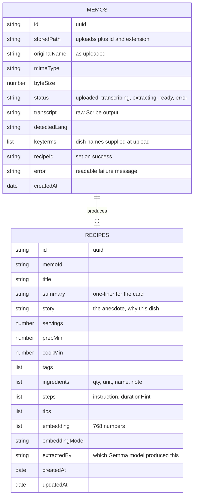
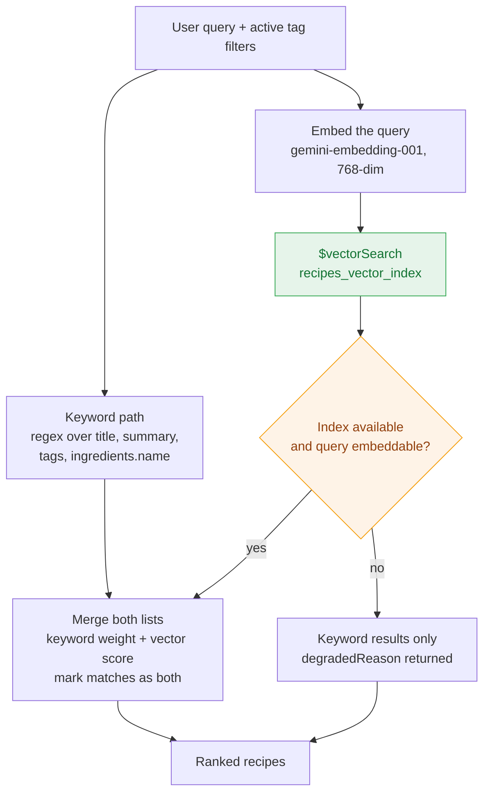

# Family Recipe Book

**Voice memos in. A structured, searchable, narrated family cookbook out — with the story kept intact.**

Built for the [Hacktoberfest Weekend Challenge: Build for a Friend](https://dev.to/challenges/hacktoberfest-weekend-2026-10-01).

Someone in the family is cooking and says out loud how they do it:

> "Two onions, finely. A fistful of this — honestly, maybe 200 grams. Fry until it smells right. The
> salt, I just say *adjust*."

That sentence contains a complete recipe and an entire person. It also vanishes the moment it is said.
So these recipes live as voice notes, buried in a WhatsApp thread between "are you coming for lunch" and
"the electrician is at 6".

This app takes the memo and returns a structured recipe — ingredients, quantities, ordered steps, tips —
and next to it the **story**: why the dish exists, who taught it, when it gets made. The original audio
and the raw transcript stay attached, so nothing gets flattened into a generic recipe blog post.

| | |
|---|---|
| **Speech to text** | ElevenLabs `scribe_v2` |
| **Extraction** | Gemma via the Gemini API — `gemma-4-31b-it`, fallback `gemma-4-26b-a4b-it` |
| **Embeddings** | `gemini-embedding-001`, 768 dimensions |
| **Retrieval** | MongoDB keyword regex **+ Atlas Vector Search** (`$vectorSearch`) |
| **Database** | MongoDB Atlas M0 (free) via Mongoose 9 |
| **Narration** | ElevenLabs TTS `eleven_flash_v2` |
| **Framework** | Next.js 16.3 (App Router, Turbopack), React 19, TypeScript strict |
| **UI** | Tailwind v4 + shadcn/ui on Base UI |
| **Validation** | Zod 4 — on every API body *and* on the model's JSON output |

**Inference cost: $0** on the free tiers (Gemma free tier, Gemini embeddings free tier, Atlas M0 free
forever, ElevenLabs free credits).

---

## Table of contents

- [How it works](#how-it-works)
- [Quick start](#quick-start)
- [Configuration](#configuration)
- [Architecture](#architecture)
- [The data model](#the-data-model)
- [API reference](#api-reference)
- [Hybrid search](#hybrid-search)
- [Cook Mode](#cook-mode)
- [Design decisions](#design-decisions)
- [Things that will bite you](#things-that-will-bite-you)
- [Scripts](#scripts)
- [Testing the external services](#testing-the-external-services)
- [Project layout](#project-layout)
- [Troubleshooting](#troubleshooting)
- [What I would build next](#what-i-would-build-next)
- [Write-up](#write-up)
- [License](#license)

---

## How it works

A memo is dropped on `/upload` and becomes a recipe with no manual transcription step. The whole pipeline
is observable from the browser while it runs.



The browser never waits on any of this. `POST /api/memos` returns `202` with a memo id immediately, and the
progress indicator polls. A failure anywhere lands on `status: "error"` with the actual message, whatever
transcript exists so far, and a "Try again" button that re-runs the pipeline on the same audio.

### The idea that makes the output worth keeping

The extraction prompt has one rule doing most of the work: **never flatten the person.** Vague quantities
get a cookable number *and* the original wording, in a separate field.

| | |
|---|---|
| **Spoken** | "a fistful of paneer — honestly maybe 200 grams" |
| **Extracted** | `{ "qty": "200", "unit": "g", "name": "paneer", "note": "a fistful, crumbled" }` |

She can cook from `200 g`. The note still sounds like her. Sensory cues survive too, because "until it
smells right" *is* the instruction in that kitchen, not a flourish to be tidied away.

---

## Quick start

```bash
git clone https://github.com/Talha-Tahir2001/family-recipe-book.git
cd family-recipe-book
npm install
cp .env.example .env.local      # fill in the three keys below
```

| Variable | Where to get it |
|---|---|
| `MONGODB_URI` | Atlas → Clusters → **Connect** → Drivers (URL-encode the password) |
| `GEMINI_API_KEY` | <https://aistudio.google.com/apikey> |
| `ELEVENLABS_API_KEY` | <https://elevenlabs.io/app/settings/api-keys> |
| `ELEVENLABS_VOICE_ID` | `npm run voices` — on the free plan pick a voice marked **premade** |

Then, in order:

```bash
npm run smoke          # verify all four external services + the database
npm run voices         # list voices, pin one for narration
npm run search:index   # create the Atlas Vector Search index
npm run seed           # synthesise 3 memos and run them end to end
npm run dev
```

Open <http://localhost:3000>.

`npm run seed` generates its own placeholder voice memos so the book is never empty — see
[What I would build next](#what-i-would-build-next) for swapping in real recordings.

---

## Configuration

Every variable, with its default:

```ini
# ---- ElevenLabs -------------------------------------------------
ELEVENLABS_API_KEY=
# Free accounts must use a "premade" voice. Professional/library voices
# return HTTP 402 paid_plan_required.
ELEVENLABS_VOICE_ID=JBFqnCBsd6RMkjVDRZzb     # George — "Warm, Captivating Storyteller"
ELEVENLABS_TTS_MODEL_ID=eleven_flash_v2
ELEVENLABS_STT_MODEL_ID=scribe_v2

# ---- Google AI Studio --------------------------------------------
GEMINI_API_KEY=
# Open-weight Gemma. Swap freely — this is the whole point.
# Check what your key can reach: GET /v1beta/models?pageSize=200
GEMMA_MODEL_ID=gemma-4-31b-it
GEMMA_FALLBACK_MODEL_ID=gemma-4-26b-a4b-it
EMBEDDING_MODEL_ID=gemini-embedding-001
EMBEDDING_DIMENSIONS=768

# ---- MongoDB Atlas -----------------------------------------------
MONGODB_URI=mongodb+srv://<user>:<password>@<cluster>.mongodb.net/?retryWrites=true&w=majority
MONGODB_DB=family-recipe-book
# See "Troubleshooting" if Atlas reports querySrv ECONNREFUSED.
DNS_SERVERS=1.1.1.1,8.8.8.8

# ---- Local storage ----------------------------------------------
UPLOAD_DIR=./uploads          # original audio, gitignored
TTS_CACHE_DIR=./cache/tts     # generated narration, gitignored
MAX_UPLOAD_BYTES=52428800     # 50 MB
```

To use a different model, change one variable. `lib/gemma.ts` is the only file that knows a provider
exists.

---

## Architecture

*Diagrams are Mermaid and render on GitHub. The DEV post embeds this README, so there they may show as
code blocks.*



**Rules the codebase follows:**

- Every external API call lives in `lib/` — `lib/elevenlabs.ts`, `lib/gemma.ts`, `lib/embeddings.ts`.
  Never in a component.
- Every UI control comes from `components/ui/*` (shadcn, Base UI primitives). Screens are *composed*;
  there are no bespoke buttons, inputs or modals.
- Every route handler validates its input with Zod before touching the database or an external API.
- Audio and generated narration live outside `public/` and are served through API routes, so family
  recordings never end up in a static asset folder or the repository.
- Secrets only from environment variables. `.env.local` is gitignored; `.env.example` is secret-free.

---

## The data model

Two collections. `memos` is the raw material, `recipes` is the product.



`extractedBy` is not vanity metadata — it is how you tell a quality regression apart from a prompt change.
It is also shown in the UI next to every recipe.

### The Atlas Vector Search index

Created by `npm run search:index` through the Node driver, which works on the free M0 tier. The collection
has to exist first, so the script creates it if missing.

```json
{
  "name": "recipes_vector_index",
  "type": "vectorSearch",
  "definition": {
    "fields": [
      { "type": "vector", "path": "embedding", "numDimensions": 768, "similarity": "cosine" },
      { "type": "filter", "path": "tags" }
    ]
  }
}
```

The vector is built from a single embedding of this string:

```
${title} — ${summary}. Ingredients: ${ingredient names}. Tags: ${tags}
```

---

## API reference

| Method | Route | Purpose |
|---|---|---|
| `GET` | `/api/recipes?q=&tag=&limit=` | Gallery + hybrid search |
| `POST` | `/api/search` | Natural-language search (Gemma rewrites the question first) |
| `GET` | `/api/recipes/:id` | One recipe plus its memo, transcript and audio availability |
| `PATCH` | `/api/recipes/:id` | Inline fix → validates with Zod → **re-embeds** so search stays accurate |
| `POST` | `/api/memos` | Multipart upload → `202` with a memo id, pipeline starts detached |
| `GET` | `/api/memos` | Recent memos with status |
| `GET` | `/api/memos/:id` | Pipeline status, transcript, error, `recipeId` |
| `POST` | `/api/memos/:id` | Retry a failed or interrupted pipeline on the same audio |
| `GET` | `/api/memos/:id/audio` | Streams the original recording |
| `POST` | `/api/recipes/:id/narrate` | One step → ElevenLabs TTS mp3, disk-cached |

### Pipeline states

```
uploaded → transcribing → extracting → ready
                                      ↘ error  (message + raw transcript + retry)
```

Transitions are written before the work they describe, so a poll that arrives mid-flight reports an honest
stage rather than a stale one.

### Narration caching

`POST /api/recipes/:id/narrate` writes to
`cache/tts/<recipeId>-<stepIndex>-<hash-of-text>.mp3`. Hashing the *text* rather than just the step index
means an edited step regenerates and an untouched one replays instantly. The response carries
`X-Tts-Cache: hit | miss`, which is how the cache was verified.

---

## Hybrid search

Two retrieval paths, merged and scored. Keyword regex covers "paneer" instantly; the vector path handles
"something warm and quick for a rainy evening".



A few details that matter in practice:

- **Stopwords are dropped before the keyword path.** "what can I make with paneer" has to search
  `paneer`. `AND`-ing every term including *what* and *can* returns nothing at all.
- **Tag filters apply to both paths.** Atlas supports a pre-filter on `$vectorSearch`.
- **Gemma's expanded tags are intersected with tags that actually exist.** A model that invents
  `["dinner","fast"]` would otherwise filter the result set down to nothing.
- **Degradation is visible.** If the index is missing or a query cannot be embedded, search falls back to
  keyword-only and returns a `degradedReason` — the UI shows an alert rather than quietly serving worse
  results and pretending nothing happened.

---

## Cook Mode

`/cook/[id]` is a full-screen, distraction-free screen meant to be propped up on a counter with floury
hands.

- One step at a time, `text-3xl` → `text-5xl`, legible at arm's length
- Prev / next / play-pause, all ≥ 44px tap targets
- Auto-narration on by default, with an explicit toggle
- ← → arrow keys work too
- Ingredients stay on screen — you check off the list without navigating away
- Per-step TTS, cached, so replays are instant

Advancing steps cannot double-trigger narration: `requestedStepRef` records which step has already been
requested, and changing step pauses the current audio before starting the next.

---

## Design decisions

**Why `after()` for the pipeline.** `POST /api/memos` returns `202` in milliseconds. The transcription and
extraction run after the response is sent, so an upload over a slow connection never holds the request
open. The browser learns about progress by polling `GET /api/memos/:id`.

**Why the transcript is shown to the user.** On failure the raw transcript appears next to the error. It
is the difference between "something went wrong" and "she said the word wrong, here is what we heard".

**Why the recipe is editable.** Extraction is good, not infallible. A one-tap fix that re-embeds the recipe
is far more honest than pretending the model was right, and re-embedding is what keeps the vector index
consistent with the text.

**Why audio is served through a route.** Family voice recordings are personal. Keeping them out of
`public/` means they are never statically cached, never in a CDN, and never committed by accident.

**Why cook mode has no site header.** It lives outside the `(site)` route group so the phone in Cook Mode
is a single purpose screen with nothing else to tap.

### Why open models, concretely

Not "open is nice" — three specific payoffs for this project:

1. **$0 marginal cost.** At per-call pricing, every future memo is a bill. For a private family book,
   nobody sets that up at all. At $0 the book keeps accepting memos for as long as the family has things
   to say.
2. **Diagnosable failures.** Open weights meant the extraction bugs were findable by reading the model's
   actual output rather than guessing at a black box — see [Things that will bite you](#things-that-will-bite-you).
3. **An exit exists.** `GEMMA_MODEL_ID` is a variable and `lib/gemma.ts` is the only provider-aware file.
   Point it at Ollama (`ollama run gemma3`) and the pipeline is unchanged, which matters when the material
   is a relative's voice and her grandmother's kitchen.

---

## Things that will bite you

Four real constraints of building against these APIs, all hit and fixed during this build. Each cost
debugging time, so each is documented.

**1. Gemma 4 returns reasoning parts.** Its response contains parts flagged `thought: true` *before* the
answer. Concatenating every part corrupts the JSON, and the symptom looks like "the model is bad at JSON"
when it is actually a parsing bug.

```ts
// lib/gemma.ts
.filter((part) => part.thought !== true)
```

**2. Zod 4 keeps defaults through `.partial()`.** The `PATCH` schema was built with `.partial()` over
fields declared `.default([])`, so saving an edited summary silently replaced ingredients and steps with
empty arrays. It surfaced as Cook Mode rendering a blank step screen. The patch schema is now built from a
default-free base object, and the route only writes keys the client actually sent:

```ts
// app/api/recipes/[id]/route.ts
const patch = Object.fromEntries(
  Object.entries(parsed).filter(([, value]) => value !== undefined)
)
```

**3. `keyterms` are repeated form fields, not a JSON array.** `keyterms=["paneer","bhurji"]` is rejected
outright. Sent correctly it visibly improves transcription — the same sentence comes back as `200 grams`
*with* keyterms and `two hundred grams* without. Dish-name hints at upload earn their keep.

**4. Free-tier voices are restricted.** Library and professional voices return
`402 paid_plan_required`. `npm run voices` marks which voices are `premade`.

**5. A stretched link needs a positioned ancestor.** shadcn's `Card` is not `position: relative`, so the
`after:absolute after:inset-0` overlay on the card title resolved against the *page* and swallowed clicks
across the whole gallery. Fix: `className="relative"` on the `Card`.

---

## Scripts

| Script | What it does |
|---|---|
| `npm run dev` | Next dev server |
| `npm run build` | Production build |
| `npm start` | Serve the production build |
| `npm run lint` | ESLint |
| `npm run typecheck` | `next typegen && tsc --noEmit` |
| `npm run format` | Prettier over `**/*.{ts,tsx}` |
| `npm run smoke` | Verify all external services — see below |
| `npm run voices` | List your ElevenLabs voices and what the free plan allows |
| `npm run search:index` | Create the Atlas Vector Search index |
| `npm run seed` | Synthesise 3 memos and run them end to end |

---

## Testing the external services

`npm run smoke` is the first thing to run after configuring `.env.local`. It exercises each dependency
independently and prints a pass/fail line, so a misconfiguration is obvious:

```text
[PASS] ElevenLabs API key + voice library
       22 voices available. Pin ELEVENLABS_VOICE_ID=JBFqnCBsd6RMkjVDRZzb (George - Warm, Captivating Storyteller)
[PASS] ElevenLabs TTS (eleven_flash_v2)
       40586 bytes of mp3 for one step
[PASS] ElevenLabs STT (scribe_v2)
       language=eng · 313 chars · "Okay, so, um, this is my grandmother's paneer bhurji, right?…"
[PASS] Gemma extraction (gemma-4-31b-it)
       "Paneer Bhurji" · 7 ingredients · 7 steps · tags=indian/vegetarian/paneer/amritsari
       sample ingredient: {"qty":"200","unit":"g","name":"paneer","note":"a fistful, crumbled"}
[PASS] Gemini embeddings (gemini-embedding-001)
       768 dimensions (index expects 768)
[PASS] MongoDB Atlas connection
       3 recipes in the book

6/6 checks passed
```

To also check transcription against a real file:

```bash
npm run smoke -- ./uploads/your-memo.m4a
```

There is no unit test suite. For a weekend project whose risk is "does this third-party API do what the
docs said", an integration smoke test against the real services caught more than mocks would have —
every bug in [Things that will bite you](#things-that-will-bite-you) was found by running the thing.

---

## Project layout

```
family-recipe-book/
├── app/
│   ├── (site)/                    # pages with the site header
│   │   ├── page.tsx               # gallery: search, tag filters, empty state
│   │   ├── upload/page.tsx        # drop a memo, watch the pipeline
│   │   └── recipes/[id]/page.tsx  # story, ingredients, steps, audio, inline edit
│   ├── cook/[id]/page.tsx         # Cook Mode — no header, one step, big type
│   └── api/
│       ├── memos/route.ts             # POST upload, GET recent
│       ├── memos/[id]/route.ts        # GET status, POST retry
│       ├── memos/[id]/audio/route.ts  # stream original audio
│       ├── recipes/route.ts           # list + hybrid search
│       ├── recipes/[id]/route.ts      # GET one, PATCH edit
│       ├── recipes/[id]/narrate/      # step -> cached mp3
│       └── search/route.ts            # natural-language search
├── components/
│   ├── ui/                        # shadcn only — CLI-installed, never hand-edited
│   ├── gallery.tsx                # search + tag filters + results
│   ├── upload-panel.tsx           # dropzone + submit + polling
│   ├── pipeline-status.tsx        # 3-stage progress, error + retry
│   ├── recipe-card.tsx            # gallery card (stretched-link aware)
│   ├── recipe-editor.tsx          # inline edit dialog
│   ├── cook-mode.tsx              # step navigation + narration
│   ├── audio-player.tsx           # original memo playback
│   └── site-header.tsx
├── lib/
│   ├── gemma.ts                   # extraction prompt, validation, model fallback
│   ├── elevenlabs.ts              # transcribe(), synthesize(), listVoices()
│   ├── embeddings.ts              # embedText() for Atlas Vector Search
│   ├── search.ts                  # keyword + $vectorSearch, merged
│   ├── pipeline.ts                # runPipeline(), re-embedding on edit
│   ├── schema.ts                  # Zod schemas shared by API + UI
│   ├── mongo.ts                   # cached connection, SRV fallback
│   ├── mongo-uri.ts               # resolve SRV, fall back to a direct shard
│   ├── dns.ts                     # optional public-DNS override
│   ├── storage.ts                 # uploads + TTS cache on disk
│   ├── audio.ts                   # accepted formats (browser-safe)
│   ├── api.ts                     # error helpers
│   └── env.ts                     # typed, validated env access
├── models/
│   ├── memo.ts                    # Mongoose schema
│   └── recipe.ts
├── scripts/
│   ├── smoke-apis.ts              # 6 external checks
│   ├── list-voices.ts
│   ├── create-search-index.ts
│   └── seed-memos.ts
├── .env.example                   # every variable, no secrets
├── PRD.md                         # requirements
├── PLAN.MD                        # execution plan and time budget
└── SUBMISSION.md                  # contest evidence checklists
```

### Conventions

- `tsconfig` paths map `@/*` to the repository root, so `app/`, `lib/`, `components/` and `models/` sit at
  the top level (Next.js allows omitting `src/`).
- Route handlers type their context with the generated `RouteContext<'/api/...'>` helper and pages with
  `PageProps<'/recipes/[id]'>`. `npm run typecheck` runs `next typegen` first, so these always resolve.
- Audio and cache directories are gitignored.

---

## Troubleshooting

**`querySrv ECONNREFUSED _mongodb._tcp.…mongodb.net`**

Your network refuses the SRV lookup Atlas needs. It is a resolver problem, not a bad cluster — the same
record resolves fine from a browser or `nslookup`.

1. Try pointing Node at public DNS:
   ```ini
   DNS_SERVERS=1.1.1.1,8.8.8.8
   ```
2. If it is still refused — observed on Windows with Next dev, where the SRV path fails in the server
   process while plain A lookups succeed — use the **legacy non-SRV string** from Atlas → Connect →
   Drivers:
   ```ini
   MONGODB_URI=mongodb://<user>:<password>@<shard-host>:27017/<db>?tls=true&authSource=admin&directConnection=true
   ```
   `lib/mongo-uri.ts` also resolves the SRV record itself and retries against a single shard, so most
   setups recover without editing anything.

   > With `directConnection=true` the connection is pinned to one shard. Fine for a family recipe book;
   > if Atlas replaces that shard, update the hostname. A working SRV URI avoids the pinning.

**`402 paid_plan_required` from ElevenLabs**

The pinned voice is a library/professional voice. Run `npm run voices` and pick one marked `premade`.

**`Gemma extraction failed after N attempt(s)`**

The error lists each model and attempt. `API key not valid` / `403` means the key; `not found for API
version v1beta` means that model ID is unavailable to your key — check `GET /v1beta/models?pageSize=200`
and update `GEMMA_MODEL_ID`.

**`Embedding dimension mismatch`**

`EMBEDDING_DIMENSIONS` and the Atlas index must agree. The index definition and `.env` are two places to
keep in sync; recreate the index after changing it.

**Search says "keyword matches only"**

Expected whenever the vector index is missing or still building. The banner is the honest signal — the
underlying reason comes back in `degradedReason`.

**`npm run typecheck` cannot find `PageProps` / `RouteContext`**

Those types are generated into `.next`. The npm script runs `next typegen` first; if you invoke `tsc`
directly after deleting `.next`, run `npm run typecheck` instead.

**Nothing loads / the book is empty**

Run `npm run seed`. It synthesises three memos and pushes them through the real pipeline, so it exercises
STT, extraction, embedding and storage in one pass.

---

## What I would build next

- **Real recordings.** `npm run seed` synthesises placeholder memos so the pipeline is demonstrable
  without a microphone. The whole point is to replace those with a family member's actual voice — drop the
  file on `/upload` and delete the seed rows when you do.
- **Realm or tiered storage.** `uploads/` and `cache/tts/` are local disk, which is correct for one
  household and wrong the moment there are two.
- **Real-time streaming transcription** instead of batch-per-memo, for someone dictating while cooking.
- **Family sharing.** Auth is explicitly out of scope in v1; the data model already has everything needed.
- **Side-by-side multilingual output** — structure in the spoken language, ingredient names in English.
- **Deploy.** The app is filesystem-backed for audio, so any host needs a persistent disk.

---

## Write-up

The full build story — the friend this was built for, the handover, and the reasoning behind the open-model
choices — is published on DEV as part of the
[Hacktoberfest Weekend Challenge: Build for a Friend](https://dev.to/challenges/hacktoberfest-weekend-2026-10-01).

Planning documents that shaped the build are kept in the repository:

| File | Contents |
|---|---|
| [`PRD.md`](./PRD.md) | Product requirements, feature specs with acceptance criteria, UX flow |
| [`PLAN.MD`](./PLAN.MD) | Execution plan, architecture, API contracts, milestones, risks |
| [`SUBMISSION.md`](./SUBMISSION.md) | Contest evidence checklists and the submission workbench |

---

## License

Built for the Hacktoberfest Weekend Challenge. The code is yours to use, adapt and learn from.